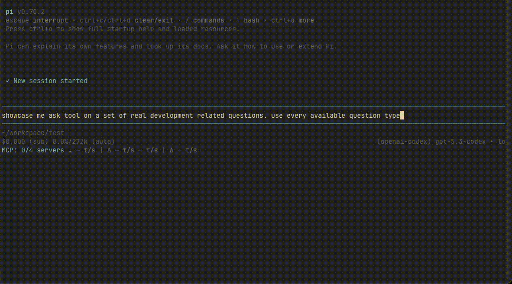

<div align="center">

# pi-tools

**Focused packages for better conversations and cleaner workflows in [Pi](https://pi.dev).**

[](https://github.com/geoqiao/pi-tools/actions/workflows/ci.yml)
[](LICENSE)
[](https://github.com/geoqiao/pi-tools/stargazers)

</div>

`pi-tools` is a small monorepo for independently published Pi packages. Each package has its own
version, manifest, documentation, tests, and release history—install only the tool you need.

## Pick a tool

### Ask better — [`@geoqiao/pi-ask`](packages/pi-ask)

[](https://www.npmjs.com/package/@geoqiao/pi-ask)
[](https://www.npmjs.com/package/@geoqiao/pi-ask)
[](https://pi.dev/packages/@geoqiao/pi-ask)

Turn ambiguity into structured answers. `pi-ask` gives agents a native `ask_user` tool with a rich
terminal UI and a portable Pi RPC fallback.

- Tabbed single-select, multi-select, and preview questions
- Optional recommendation markers that never preselect an answer
- Free-form answers, notes, review, and elaboration flows
- Native `@` file references and configurable keymaps
- `/answer` and replay commands for questions that started as plain text
- Recovery of interrupted `ask_user` forms after startup, resume, or fork

```bash
pi install npm:@geoqiao/pi-ask
```

<a href="packages/pi-ask">
  
</a>

[Read the package guide →](packages/pi-ask)

> `@geoqiao/pi-ask` is an independently maintained continuation of
> [`eko24ive/pi-ask`](https://github.com/eko24ive/pi-ask), preserving its history, license, and
> attribution.

---

### Keep moving — [`@geoqiao/paseo-btw`](packages/paseo-btw)

[](https://www.npmjs.com/package/@geoqiao/paseo-btw)
[](https://www.npmjs.com/package/@geoqiao/paseo-btw)
[](https://pi.dev/packages/@geoqiao/paseo-btw)

Open a lightweight side conversation in [Paseo](https://paseo.sh/) without interrupting the main
task. The side agent runs in the same workspace and appears in the Subagents track.

- Native `/btw` and `/paseo-btw` commands for zero-parent-turn launches in Pi
- Inherits the parent provider, model, thinking mode, and bounded context by default
- Portable Agent Skill fallback for Pi, Codex, Claude Code, and other compatible clients
- Persistent controls for model and context inheritance

```bash
pi install npm:@geoqiao/paseo-btw
```

For Agent Skills clients that cannot load Pi extensions:

```bash
npx skills add geoqiao/pi-tools --skill paseo-btw --agent '*' -g
```

[Read the package guide →](packages/paseo-btw)

## Workspace

```text
packages/
├── pi-ask/      # Interactive clarification tool and ask-user skill
└── paseo-btw/   # Paseo side-conversation extension, CLI, and portable skill
```

The packages share repository tooling but have no runtime coupling. Installing or releasing one
does not install or release the other.

## Development

Requires Node.js and [pnpm](https://pnpm.io/).

```bash
pnpm install
pnpm test
pnpm typecheck
pnpm pack:check
```

Run a focused check with a package filter:

```bash
pnpm --filter @geoqiao/pi-ask test
pnpm --filter @geoqiao/paseo-btw test
```

See [CONTRIBUTING.md](CONTRIBUTING.md) for the full contribution and release workflow.

## Releases

[Changesets](https://github.com/changesets/changesets) versions and publishes each package
independently. Add a changeset for user-facing package changes:

```bash
pnpm changeset
```

Publishing runs through the repository's GitHub Actions release workflow and npm trusted
publishing, so released artifacts can carry verifiable provenance. The root workspace is private
and is never published.

## License

[MIT](LICENSE) © Geo Qiao. Individual package attribution is preserved in each package directory.
