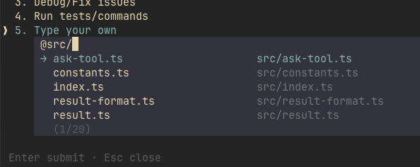
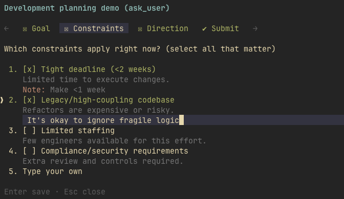
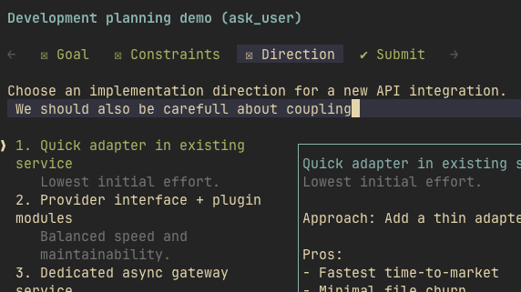
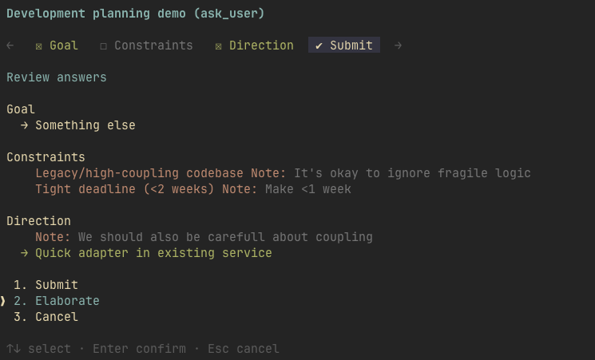
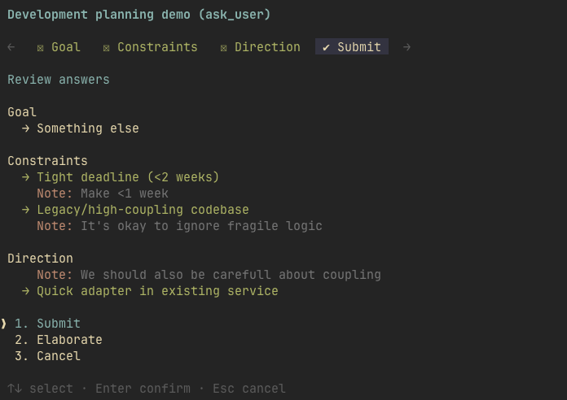
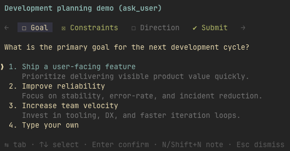
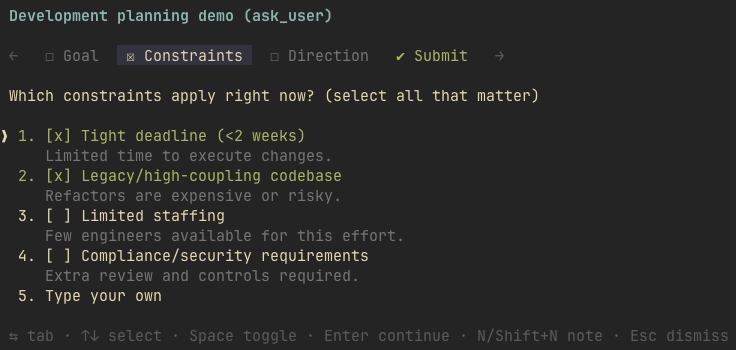
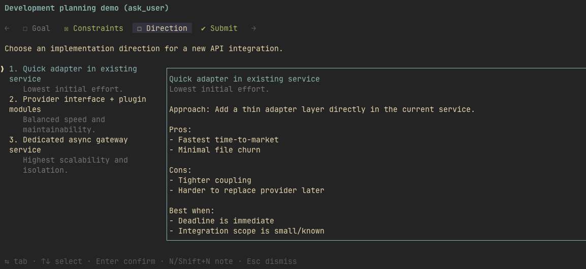
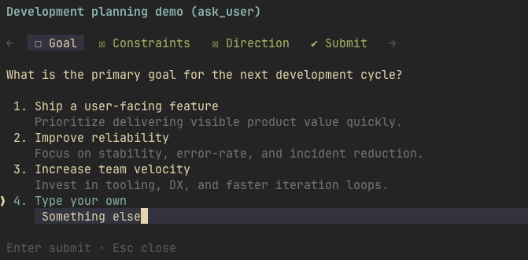

# Pi Ask

[](https://www.npmjs.com/package/@geoqiao/pi-ask)
[](https://www.npmjs.com/package/@geoqiao/pi-ask)
[](https://github.com/geoqiao/pi-tools/actions/workflows/ci.yml)

**Answer your agent's questions without losing the thread.**

`@geoqiao/pi-ask` adds structured clarification to [Pi](https://pi.dev): choose options, type your own answer, or ask for an explanation before deciding. Get a rich terminal form in TUI mode and portable sequential dialogs in RPC mode, with normalized answers returned to the agent.


[Watch the high-quality demo](https://github.com/user-attachments/assets/a8503ca9-afcb-4c31-9edc-353b985a0209)

[Quick start](#quick-start) · [Everyday use](#everyday-use) · [TUI and RPC](#tui-and-rpc) · [Settings](#settings) · [Documentation](#documentation)

## Quick start

```bash
pi install npm:@geoqiao/pi-ask
```

Run `/reload` in an already-open Pi session. The agent can then call `ask_user` when clarification is needed; you can also explicitly ask it to interview you.

To try the package for one run without adding it to your saved package configuration:

```bash
pi -e npm:@geoqiao/pi-ask
```

If the agent has already asked questions in plain text, run `/answer` in TUI mode to turn its latest completed message into a form.

> Independently maintained continuation of [eko24ive/pi-ask](https://github.com/eko24ive/pi-ask), preserving the upstream history, MIT license, and attribution while adding portable Pi RPC support.

## Everyday use

| Need | Feature |
|---|---|
| Choose one answer or several | Single-select, multi-select, and preview questions |
| Give an answer outside the options | Inline `Type your own`, with native Pi-style `@` file references |
| Understand a choice before deciding | Notes on a question or option, followed by `Elaborate` |
| Review before continuing | `Submit`, `Elaborate`, and `Cancel` review actions in TUI |
| See the agent's recommendation | Optional `(recommended)` markers with reasons; never preselected |
| Recover a previous form | Replay commands and automatic recovery of interrupted TUI asks |

### Commands

| Command | What it does |
|---|---|
| `/answer` | Extracts questions from the latest completed assistant message and opens an ask form |
| `/answer:again` | Reopens the latest `/answer` form on the current branch |
| `/ask:replay` | Reopens the latest real `ask_user` form on the current branch |
| `/ask-settings` | Opens the settings overlay; `?` inside a form opens the same overlay |

These commands are TUI-only. Replay is branch-aware and works with `/resume` and `/tree`. Closing a command-opened form does not start an agent turn; submitting or elaborating sends a normal user follow-up.

`/answer` uses a configured extraction model and the preceding user message as context. It validates the extracted form and retries missing or invalid output. Normal `ask_user` calls do not use this extraction model. See [extraction settings](docs/configuration.md#answer-extraction).

### When the agent asks

The agent should read available code, docs, conversation, and prior answers first. It asks only for unresolved critical requirements, outcome-changing preferences, or consequential/hard-to-reverse actions beyond existing authorization. Explicitly requested interviews, requirements gathering, and interactive questions also use `ask_user`.

Clear small changes, settled choices, authorized reversible steps, and routine implementation details proceed without reconfirmation. Multiple options or architecture/naming/research labels alone do not trigger questions; clear comparison/research requests get analysis first. Follow-ups address only current blockers, and settled decisions reopen only for materially new information.

Delegated autonomy does not waive safety boundaries. Cancellation, skipped questions, and unclear answers are not high-risk approval. This is prompt guidance, **not a runtime permission check or a guarantee of model behavior**. See the [policy and verification limits](docs/contract.md#skill-alignment-advisory) and [skill examples](skills/ask-user/SKILL.md#examples-and-behavioral-evaluation-cases).

## TUI and RPC

Both modes return normalized answers, but their interfaces differ:

| Capability | TUI | RPC with portable UI support |
|---|---|---|
| Layout | Tabbed, same-screen form | Sequential dialogs with `[current/total]` progress |
| Answers | Native single/multi selection and custom text | One real option or `Type something…`; type multiple choices as free-form text |
| Previews and recommendations | Preview pane and recommendation subtitles | Details flattened into option text; canonical labels and values stay unchanged |
| Notes and review | Question/option notes and final review tab | No notes or final review; submitting an option advances directly |
| Settings and replay commands | Supported | TUI-only |
| Dismissal | Flow-level cancel/dismiss, with optional dirty-state confirmation | Dismissing a card or input skips that question; tool abort cancels the flow |

RPC does not emulate checkbox cards, repeated multi-select dialogs, or custom preview panes. Unanswered questions remain unanswered, including those marked `required`: that field is advisory, not submission enforcement.

Print, JSON, and RPC without portable UI cannot open a form. They return a needs-user-input message with pending questions rather than pretending to collect answers.

### Interrupted forms

Starting, resuming, or forking a TUI session recovers its newest unresolved `ask_user` form once. Submission is delivered as a user message because the original tool execution no longer exists. Submit or cancel prevents another automatic reopen; `/ask:replay` remains available.

New sessions, extension reloads, non-TUI modes, and RPC do not trigger recovery.

## Settings

Open `/ask-settings`, or press `?` inside the TUI form. You can adjust auto-submit, dirty-dismiss confirmation, review shortcut confirmation, single-as-multi presentation, footer hints, and notifications. Resetting defaults requires a guarded double press.

Settings save when the file is writable; failed saves revert the change and show a manual-edit message. Invalid files and load-time migrations do not rewrite user-owned configuration. The established upstream-compatible path remains:

```text
~/.pi/agent/extensions/eko24ive-pi-ask.json
```

For the complete config shape, defaults, keymap rules, notification channels, and extraction settings, use **[docs/configuration.md](docs/configuration.md)** rather than copying a second config example from this README. You can also ask your agent to configure pi-ask; it is instructed to read that guide first.

### Handy default keys

| Key | Context | Action |
|---|---|---|
| `Tab` / `Shift+Tab` | Main flow | Next / previous question tab |
| `↑` / `↓` | Main flow | Move between options |
| `Enter` / `Space` | Main flow | Confirm / toggle |
| `1..9` | Options | Select or toggle by number |
| `n` / `Shift+N` | Main flow | Add an option / question note |
| `t` | Main flow | Change the current question type |
| `?` | Form | Open settings |
| `@` | Answer and note editors | Complete a file reference |

In non-empty editors, arrows and `Tab` stay with the text. On the review tab, `1`, `2`, and `3` mean Submit, Elaborate, and Cancel; by default, each needs a second press. Destructive multi-to-single changes also require confirmation. The single-as-multi setting applies to new/replayed forms; `t` changes the active question. See [keymaps](docs/configuration.md#keymaps) for customization and the [contract](docs/contract.md#keyboard-behavior) for exact editing and cancellation behavior.

<details>
<summary>Feature screenshots</summary>

| Feature | Preview |
|---|---|
| File references in answers and notes |  |
| Option and question notes |   |
| Elaborate and Submit review |   |
| Single and multi selection |   |
| Rich option previews |  |
| A custom answer |  |

</details>

## Documentation

| Guide | Contents |
|---|---|
| [Configuration](docs/configuration.md) | Settings, keymaps, notifications, and `/answer` extraction |
| [Contract](docs/contract.md) | Input/output, TUI/RPC behavior, replay, and recovery guarantees |
| [Architecture](docs/architecture.md) | Module responsibilities and invariants |
| [Remote events](docs/remote-events.md) | Trusted local inter-extension integration |
| [Ask User skill](skills/ask-user/SKILL.md) | Context-first clarification policy and behavioral evaluation cases |

The bundled skill is enabled by default when installed and can be disabled through `pi config`. Tool guidance remains available without it.

## Development

From the monorepo root:

```bash
pnpm --filter @geoqiao/pi-ask dev
pnpm --filter @geoqiao/pi-ask dev /absolute/path/to/project
```

The dev script isolates this extension and its bundled skill using `--no-extensions --no-skills --no-prompt-templates --no-themes --no-context-files`, then changes to the target directory before launching Pi. To load just the extension manually, run `pi -e ./src/index.ts` from this package directory.

```bash
pnpm --filter @geoqiao/pi-ask typecheck
pnpm --filter @geoqiao/pi-ask test
pnpm --filter @geoqiao/pi-ask pack:check
```

See [CONTRIBUTING.md](../../CONTRIBUTING.md) for workspace setup, formatting, conventional commits, and Changesets. Local hooks are optional and are not installed automatically; run `pnpm exec lefthook install` at the workspace root if wanted. Keep README media in `docs/media/`; these assets are repository-only.

## Attribution and contributions

[MIT](LICENSE). This independently maintained continuation preserves [eko24ive/pi-ask](https://github.com/eko24ive/pi-ask)'s history and attribution. Development and issues live in [geoqiao/pi-tools](https://github.com/geoqiao/pi-tools).

Thanks to [@k0valik](https://github.com/k0valik) for the `/answer` idea. The bundled skill was inspired by [edlsh/pi-ask-user](https://github.com/edlsh/pi-ask-user).
